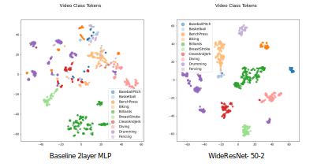

# Human Activity Recognition (HAR) with Transformer based on Convolutional Features

This is repository for codebase of [this project](https://drive.google.com/file/d/1siob3zeGM6l34CkSx0RkccTs84_T_Q7D/view?usp=sharing).

### [**Google Colab Testing Playground**](https://colab.research.google.com/drive/1Wmw8CDzSZzch42dq1NpSyO_Th5Kqe--x?usp=sharing)
Next few sections detail on how to setup repository, download datasets and get weights hosted on Google Drive. However, you can bypass this and test directly on Google Colab where all of this setup is nicely written in code and has GPU access for testing.

<p align="center">
    
</p>

This project aims to perform Human Activity Recognition directly on RGB image frames instead of using 2D Pose Estimations[1]. We use temporal and spatial features extracted from real-life action videos from UCF-50/101 Datasets and use an architecture based on Convolutional Neural Networks (CNN) and Transformer and try to prove that convolutional features perform better than linear projection in usual Vision Transformer.
<p align="center">
    
</p>

### Basic Usage:

```python main.py --config <config/path-to-config-file.yaml> --pipeline <train|test>```

Please review config files for training settings

### Installation and Setup
We provide a package for training and testing and you can install this package, preferably in a seperate python environment. Use following commands for setup.

```
git clone https://github.com/m-hamza-mughal/Conv-AcT-pytorch.git
cd Conv-AcT-pytorch/
pip install -e .
```
### Download UCF-50 and UCF-101
You can download the datasets and label files for [UCF-50](https://www.crcv.ucf.edu/data/UCF50.php) and [UCF-101](https://www.crcv.ucf.edu/data/UCF101.php) from their website or follow these commands to do that. Please note that these commands are for Linux environment. If you are on Mac or Windows, you might need to make adjustments like swapping installation for `unrar` and `unzip` using brew.

```
cd Conv-AcT-pytorch/datasets/
apt install unrar unzip
wget https://www.crcv.ucf.edu/data/UCF50.rar --no-check-certificate
unrar x UCF50.rar -idq
mkdir ./ucf50TrainTestlist
wget -P ./ucf50TrainTestlist https://github.com/temur-kh/video-classification-cv/raw/master/data/classInd.txt
wget -O ./ucf50TrainTestlist/testlist01.txt https://github.com/temur-kh/video-classification-cv/raw/master/data/testlist.txt
wget -O ./ucf50TrainTestlist/trainlist01.txt https://github.com/temur-kh/video-classification-cv/raw/master/data/trainlist.txt
rm UCF50.rar 
cp -r UCF50/ UCF10/
cp -r ./ucf50TrainTestlist/ ./ucf10TrainTestlist/
wget https://www.crcv.ucf.edu/data/UCF101/UCF101.rar --no-check-certificate
wget https://www.crcv.ucf.edu/data/UCF101/UCF101TrainTestSplits-RecognitionTask.zip --no-check-certificate
unrar  x UCF101.rar -idq
unzip UCF101TrainTestSplits-RecognitionTask.zip
rm UCF101.rar UCF101TrainTestSplits-RecognitionTask.zip
%cd -
```
To create a UCF-10 Subset mentioned in the report, you can follow our [Google Colab Testing Playground](https://colab.research.google.com/drive/1Wmw8CDzSZzch42dq1NpSyO_Th5Kqe--x?usp=sharing) to get Python code snippets which create them automatically, provided the path for UCF-50 dataset.

### Download Weights
We provide weights for selected three experiments on UCF-10, UCF-50 and UCF-101 Datasets which are hosted on [Google Drive](https://drive.google.com/drive/folders/1gpbbRSQ2MHwlUJuIpJJxXgcWvepCXi--?usp=sharing). Moreover you can download individual weights using bash after installing `gdown` or by manualling downloading from Google Drive

```
pip install gdown
cd Conv-AcT-pytorch/
```
UCF-10 WideResNet-50-2:
```
gdown https://drive.google.com/drive/folders/1mTKk0qwQcZ5mBwjZgJV0rIH2GQg88eXu?usp=sharing -O ./logs/best_model_ucf10_resnet_full --folder
```
UCF-50 WideResNet-50-2:
```
gdown https://drive.google.com/drive/folders/15Rm1K5NahAAq4ZmpLWljgEuNWBTNs95B?usp=sharing -O ./logs/best_model_83_ucf50_wide_resnet50_2_att4 --folder
```
UCF-101 WideResNet-50-2:
```
gdown https://drive.google.com/drive/folders/1BRixVCVUyREED86TeK40rtGMXr3qlyVF?usp=sharing -O ./logs/30fr_wrn50_unfrozen --folder
```
If you need weights for other experiments, let us know using email below, we can provide you separately because currently we have space limit on Google Drive.

### Testing:
UCF-10 WideResNet-50-2:
```
cd Conv-AcT-pytorch/
python main.py --pipeline test --config ./logs/best_model_ucf10_resnet_full/config.yaml
```
UCF-50 WideResNet-50-2:
```
cd Conv-AcT-pytorch/
python main.py --pipeline test --config ./logs/best_model_83_ucf50_wide_resnet50_2_att4/config.yaml
```
UCF-101 WideResNet-50-2:
```
cd Conv-AcT-pytorch/
python main.py --pipeline test --config ./logs/30fr_wrn50_unfrozen/config.yaml
```

### Training:
For training you can review config files for training settings and make your own config file or use one of the existing ones. 

```python main.py --config <config/path-to-config-file.yaml> --pipeline train```

### Experimentation:
For experimentation, use `notebooks/experiments.ipynb`

### Condor:
We have also provided `Dockerfile` in condor directory along with submission file `ucf.sub` which you can use to deploy training jobs on condor.


Thankyou for reading till now :)<br>
In case of questions, contact <br>
Hamza Mughal<br>
mumu00003@stud.uni-saarland.de


References:<br>
Vittorio Mazzia, Simone Angarano, Francesco Salvetti, Federico Angelini, and Marcello Chiaberge. 
Action transformer: A self-attention model for short-time pose-based human action recognition. 
*Pattern Recognition*, page 108487, 2021


